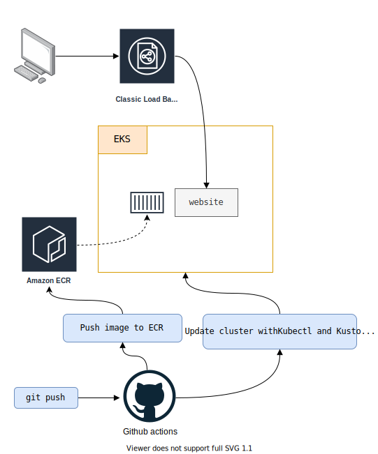

# aws-kubernetes-github-actions

Creation of a **website**, hosted on a **Kubernetes cluster**. Use **Kubectl**, **Kustomize** and **Github actions** to deploy it in a **GitOps** way. 

- `master` branch : original version using **eksctl**.
- `terraform` branch : updated version using **terraform** + without **eksctl**.

